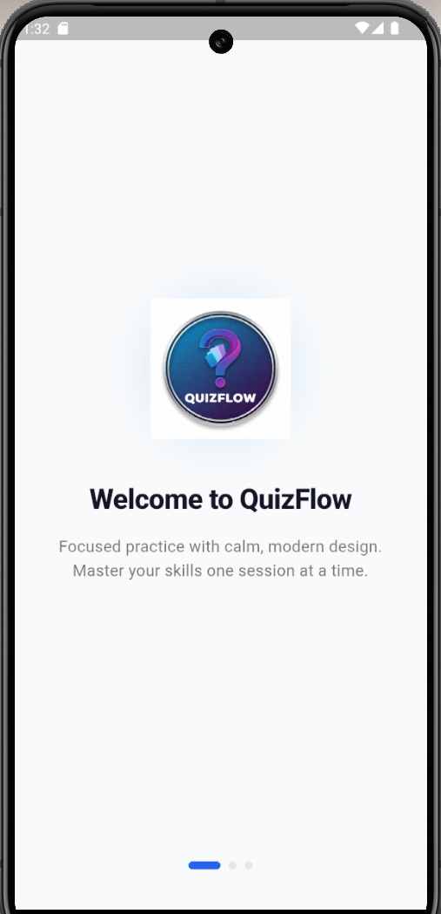
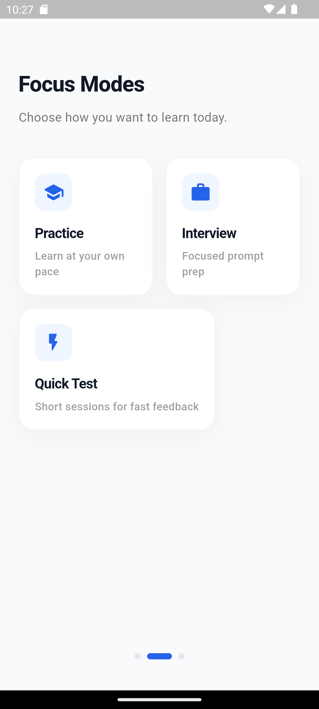
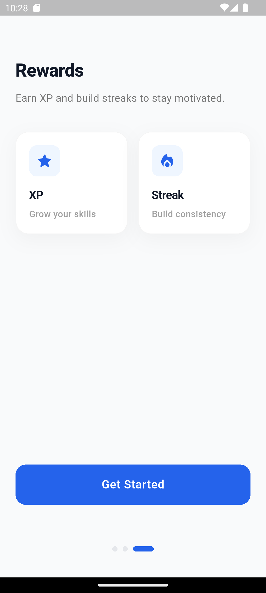
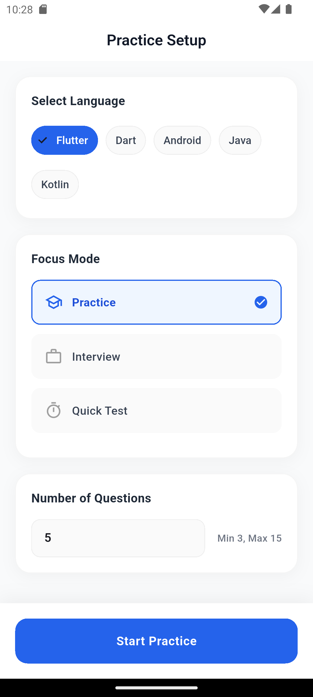
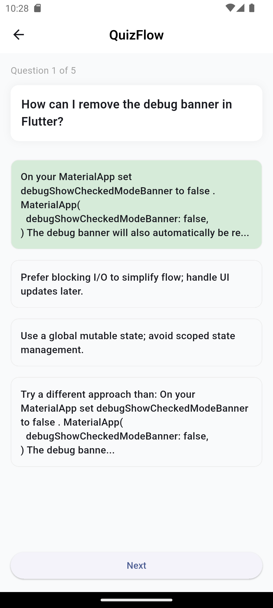
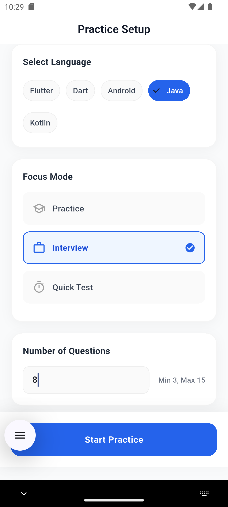
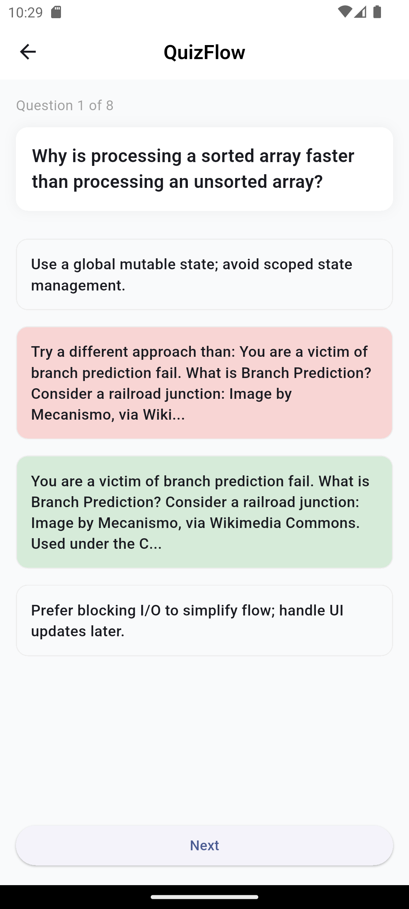
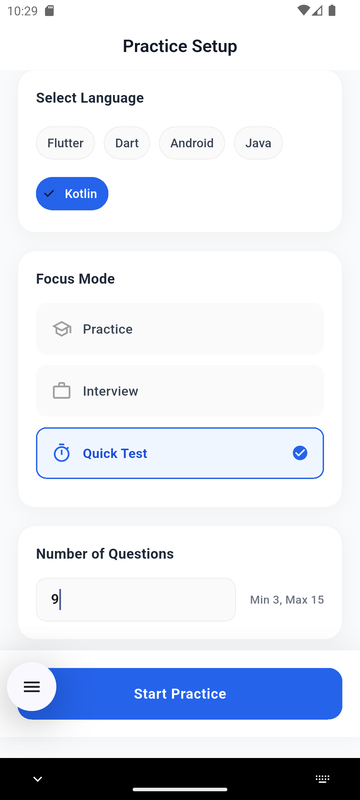
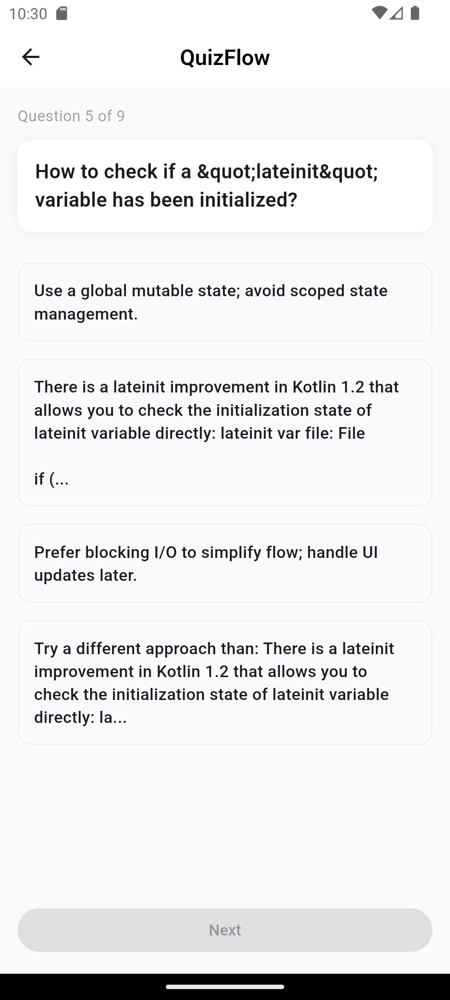

# QuizFlow

A Flutter-based quiz application for developers to practice technical skills with customizable focus modes.

## 🧩 Overview

QuizFlow addresses the need for structured, distraction-free technical skill practice. It allows developers to test their knowledge in Flutter, Dart, Android, Java, and Kotlin through a clean mobile interface. The application supports different learning styles via specific focus modes (Practice, Interview, Quick Test) and tracks user sessions.

## ✨ Features

-   **Multiple Focus Modes**:
    -   Practice: Standard quiz mode.
    -   Interview: Simulates interview-style questions.
    -   Quick Test: Fast-paced assessment.
-   **Topic Selection**: Support for Flutter, Dart, Android, Java, and Kotlin.
-   **Customizable Sessions**: Adjust question count from 3 to 15 questions per session.
-   **Onboarding Flow**: Introductory screens for first-time users.
-   **Live Quiz Interface**: Interactive question handling with real-time feedback.

## 🛠️ Tech Stack

-   **Frontend**
    -   Flutter
    -   Dart
    -   Shared Preferences
    -   HTTP
-   **Backend**
    -   Python
    -   FastAPI
    -   Uvicorn
    -   BeautifulSoup4
-   **Tools / Services**
    -   Render (API Hosting)

## 🗂️ Project Structure

-   `frontend/` - Main Flutter application code.
-   `backend/` - FastAPI backend service for serving quiz questions.
-   `screenshots/` - UI screenshots.
-   `frontend/lib/screens/` - UI screens (Setup, Quiz, Onboarding).
-   `frontend/lib/services/` - API and local storage services.

## 🖼️ Screenshots

### Onboarding
<p align="center">
  
  
</p>
<p align="center">
  
</p>
*Initial welcome screen, focus mode explanation, and final onboarding step.*

### Practice Mode
<p align="center">
  
  
</p>
*Home screen with Practice mode selected and active quiz question.*

### Interview Mode
<p align="center">
  
  
</p>
*Home screen with Interview mode selected and active quiz question.*

### Quick Test
<p align="center">
  
  
</p>
*Home screen with Quick Test mode selected and active quiz question.*

## ⚙️ Setup & Installation

### Prerequisites
-   Flutter SDK
-   Dart SDK

### Installation steps

```bash
# Clone the repository
git clone <repository-url>

# Navigate to frontend
cd quizflow/frontend

# Install dependencies
flutter pub get
```

### Run locally

```bash
flutter run
```

## ▶️ Usage

1.  Open the application (complete onboarding if first launch).
2.  On the **Practice Setup** screen, select a **Language** (e.g., Flutter, Dart).
3.  Choose a **Focus Mode** (Practice, Interview, or Quick Test).
4.  Enter the desired **Question Count** (3-15).
5.  Tap **Start Practice** to begin the quiz.
6.  Select answers and tap **Next** to proceed.

## ⚠️ Limitations

-   **Internet Required**: The app relies on an external API (`quiz-flow-vxs8.onrender.com`) to fetch questions.
-   **Question Count**: Restricted to a minimum of 3 and maximum of 15 questions per session.
-   **Platform**: Currently optimized for mobile (Android/iOS).

## 📄 License

License not specified.
