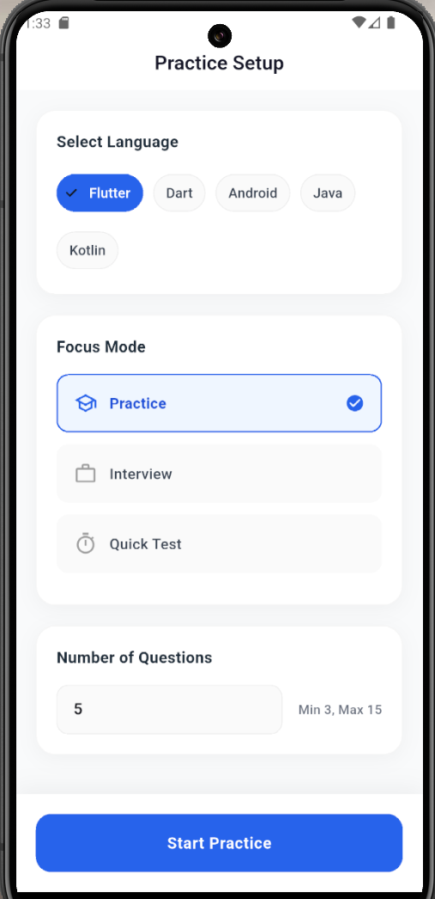
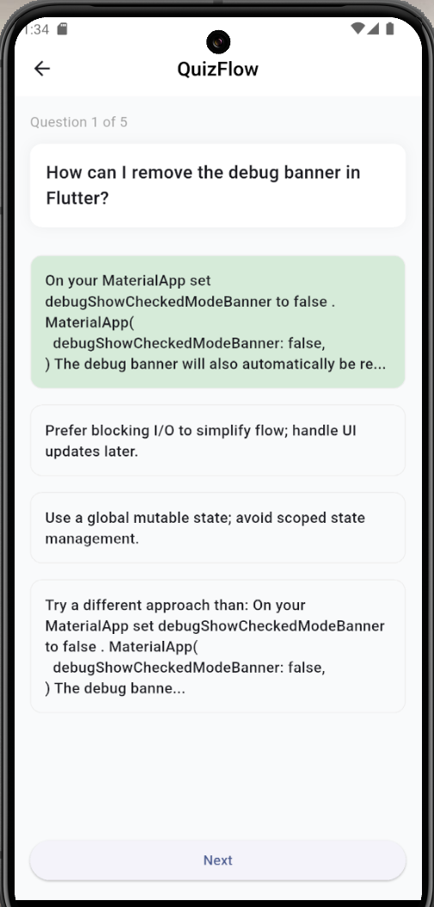

# QuizFlow

QuizFlow is a cross‑platform learning app that delivers focused, session‑based practice using modern Flutter UI and a FastAPI backend. It fetches real programming questions from Stack Overflow and generates high‑quality multiple‑choice quizzes with one correct answer and three plausible distractors. The experience is calm, premium, and optimized for mobile and desktop targets.

## Key Features
- Real questions sourced from Stack Overflow
- AI‑generated distractors; correct option comes from accepted answers
- Strict validation and safe fallbacks (never crashes)
- Three focus modes: Practice, Interview, Quick Test
- Clean Material 3 design: splash, onboarding, setup, quiz
- Lightweight caching to avoid repeated processing
- Rewards: XP and streak tracking (client side)

## Tech Stack
- Frontend: Flutter (Material 3), http, shared_preferences
- Backend: FastAPI, Uvicorn, Pydantic, Requests, BeautifulSoup
- Data Source: Stack Exchange API (Stack Overflow)
- Caching: In‑memory TTL cache on backend

## Architecture Overview
- Flutter client calls the backend endpoint `/quiz?tag=<language>&limit=<count>` to retrieve questions.
- Backend:
  - Fetches questions from Stack Overflow (tagged by language).
  - Extracts the accepted answer as the correct answer.
  - Generates three AI‑like distractors and validates output (4 options, non‑empty, single correct).
  - Falls back to Q&A mode when generation or validation fails (never crashes).
  - Caches results per question key `quiz:{tag}:{question_id}`.

## Repository Structure
- `frontend/` Flutter application (lib/screens, assets, platform folders)
- `backend/` FastAPI application
  - `app/main.py` FastAPI app entry
  - `app/routes/quiz.py` Quiz endpoint
  - `app/models/quiz.py` Pydantic response model
  - `app/services/stackexchange.py` Stack Exchange fetchers
  - `app/services/mcq_ai.py` Distractor generation service
  - `app/services/mcq_builder.py` MCQ construction, validation, caching
  - `app/services/cache.py` In‑memory TTL cache
  - `app/utils/text_cleaner.py` HTML→text cleanup

## Backend Setup
1. Prerequisites:
   - Python 3.10+
   - Recommended: virtualenv
2. Install dependencies:
   ```bash
   cd backend
   pip install -r requirements.txt
   ```
3. Run the server:
   ```bash
   uvicorn app.main:app --host 0.0.0.0 --port 8000
   ```
4. API:
   - `GET /quiz?tag=<language>&limit=<3..15>`
   - Response shape:
     ```json
     {
       "tag": "flutter",
       "mode": "live",
       "count": 5,
       "questions": [
         {
           "id": 123,
           "question": "Title from Stack Overflow",
           "options": ["A","B","C","D"],
           "correct_index": 2,
           "type": "mcq" // or "qa" fallback
         }
       ]
     }
     ```

## Frontend Setup
1. Prerequisites:
   - Flutter SDK (3.7+)
2. Install dependencies:
   ```bash
   cd frontend
   flutter pub get
   ```
3. Assets:
   - Declared in `frontend/pubspec.yaml` as:
     ```yaml
     assets:
       - assets/logo/
     ```
   - Ensure `frontend/assets/logo/quiz_flow_logo.jpg` exists.
4. Base URL:
   - Android emulator uses `http://10.0.2.2:8000`.
   - For iOS/simulator or web/desktop, update the `baseUrl` in `lib/services/api_service.dart` to match your backend host as needed.
5. Run:
   ```bash
   flutter run
   ```

## Usage
1. Start backend (port 8000).
2. Launch frontend app.
3. Flow:
   - Splash → Onboarding → Practice Setup
   - Choose language, focus mode, and question count (3–15)
   - Start practice and answer MCQs; immediate feedback shows green for correct and red for incorrect

## Screenshots
Below are representative screens. Filenames follow numeric order for clarity.

- Onboarding 01  
  
- Onboarding 02  
  
- Onboarding 03  
  
- Home / Setup 04  
  
- Quiz 05  
  

## Validation and Reliability
- AI output is validated server‑side:
  - Exactly 4 options
  - One correct index in bounds
  - No empty options
  - Unique options to avoid duplicates
- If validation fails, backend returns a safe Q&A entry (single correct answer), ensuring the app never crashes.
- Caching avoids repeat processing of the same question.

## Contributing
- Keep changes minimal and aligned with the established architecture.
- Avoid introducing secrets into code or logs.
- Prefer small, focused PRs and preserve response contracts consumed by the Flutter app.

## License
This project is provided for educational and demonstration purposes. License terms can be added here if you plan to distribute or publish.
